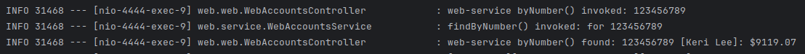
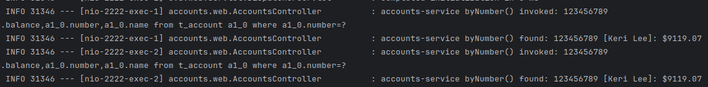
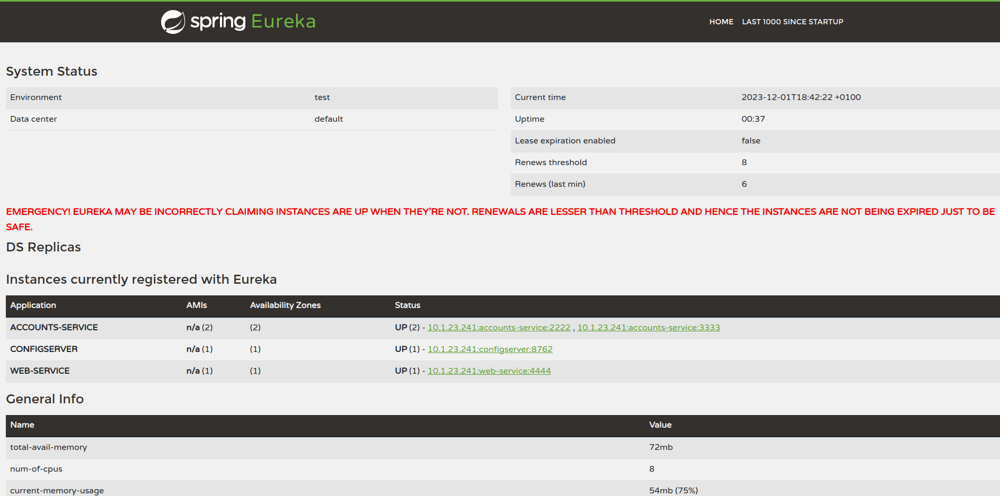
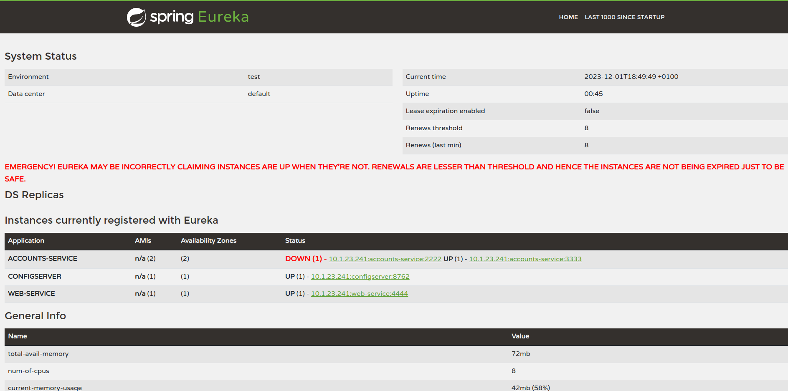
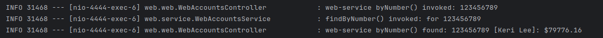
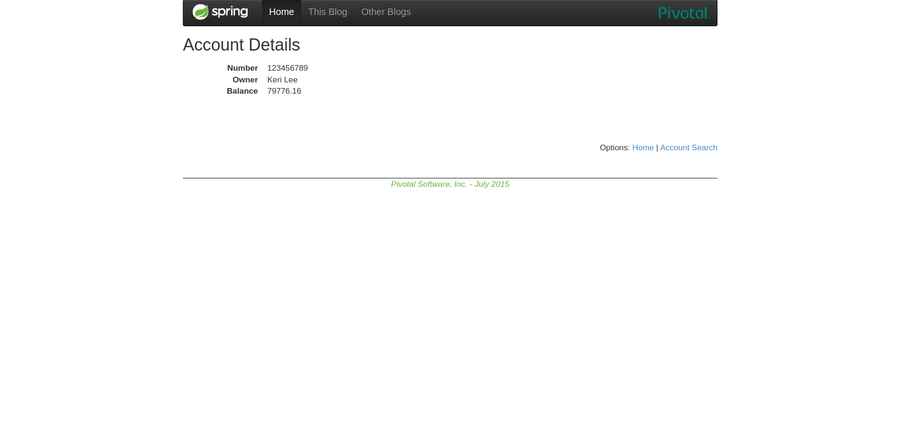

# Practica 6

Author: Marcos Pérez Guillén (820532)
Date: 01/12/2023

## two services `accounts (2222)` and `web` are running and registered

Se han modificado los archivos:
 - accounts-service.yml
 - web-service.yml

Lanzamos el discovery, config, accounts y servidor.

Si realizamos una peticion del web al accounts podemos ver como no salta
una extepcion, por lo tanto ambos estan corriendo.

Esto obtiene el web al realizar la peticion:

Esto es lo que obtiene el account al realizar la peticion:

## The service registration service has these two services registered

## Update the configuration repository so that the `accounts` service uses now the port 3333

<https://github.com/marcospg26/lab6-microservices-config-repo/commitf1e8b37fd09b3968bbd9c14a8b31f4f12a024bb7>

## Run a second instance of the `accounts` service using the new configuration. What happens?

Se ve como sin parar la ejecucion hemos sido capaces de que se configure el nuevo accounts al puerto 3333, sin necesidad de cortar la ejecucion.

## What happens when you kill the service `accounts (2222)` and do requests to `web`?

Se desconecta y aparece como DOWN si matamos el account del puerto 2222.

Si ahora realizamos otra peticion, nos respondera el account del puerto 
3333, y como no salta ninguna excepcion podemos suponer que funciona 
correctamente.

Cambia el numero que nos devuelve por lo tanto nos responde un account
distinto del de la primera peticion. 

## Can the web service provide information about the accounts again?. Why?

Si, el web seguira  obteniendo informacion del account:

Por que el cambio de confuguracion se ha realizaddo correctamente, por eso
podra seguir obteniendo informacion.
