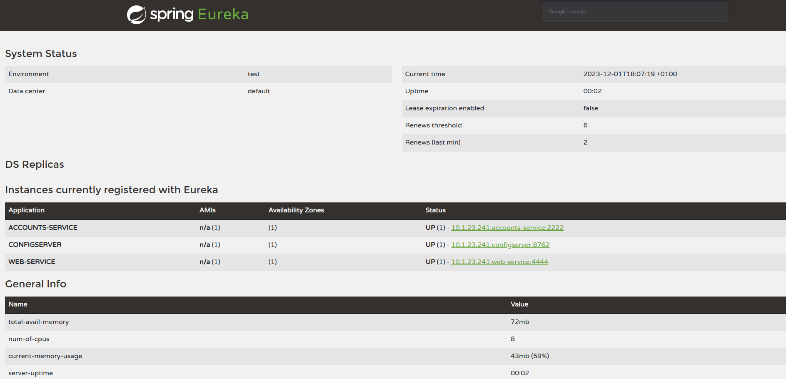

# Practica 6

## two services `accounts (2222)` and `web` are running and registered

Se han modificado los archivos:
 - accounts-service.yml
 - web-service.yml

## The service registration service has these two services registered

